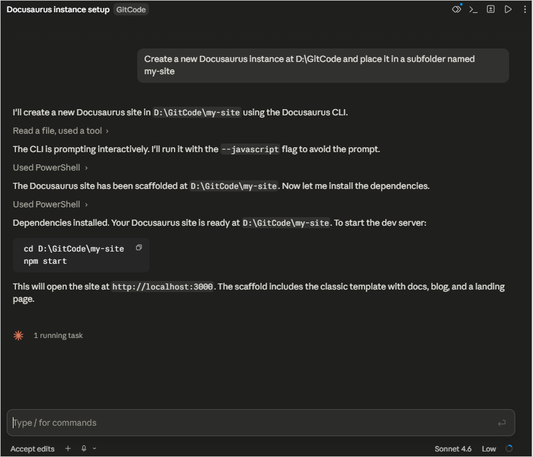
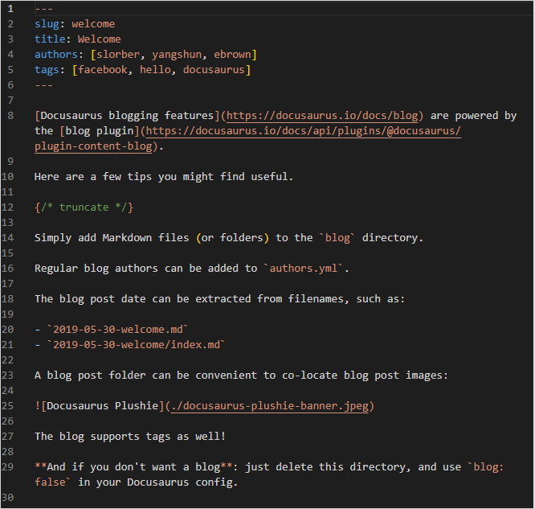
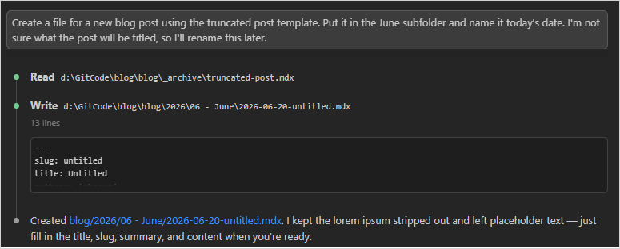
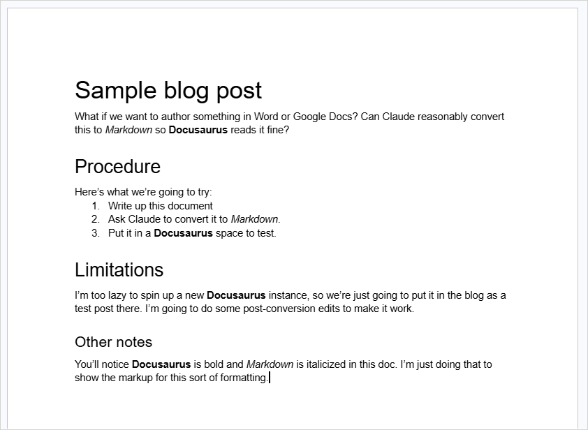
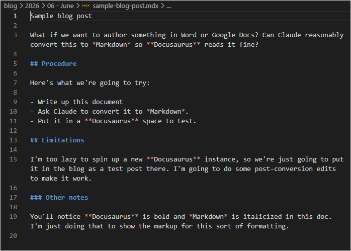
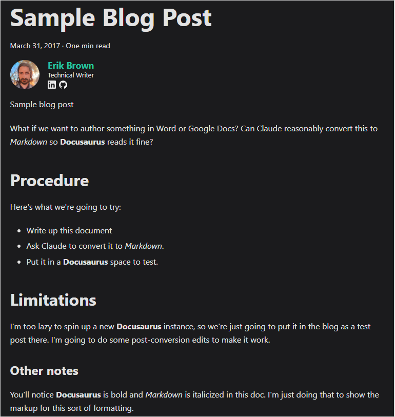
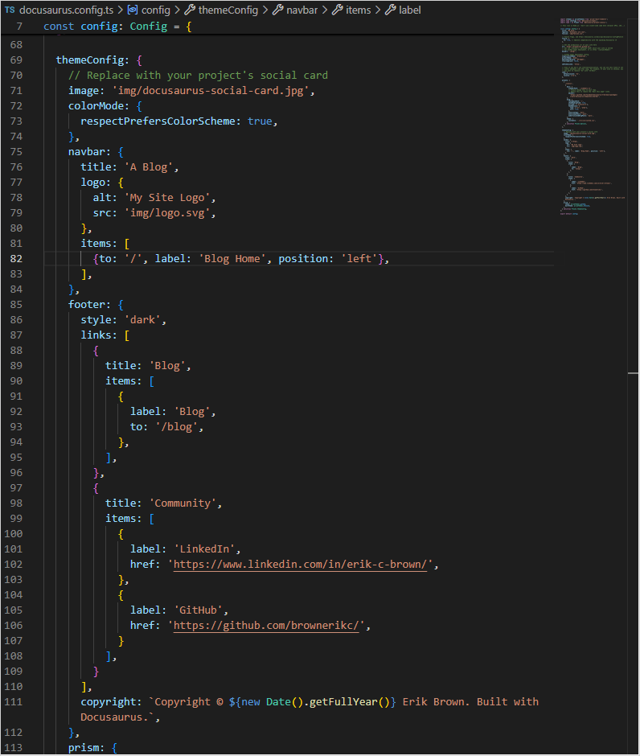
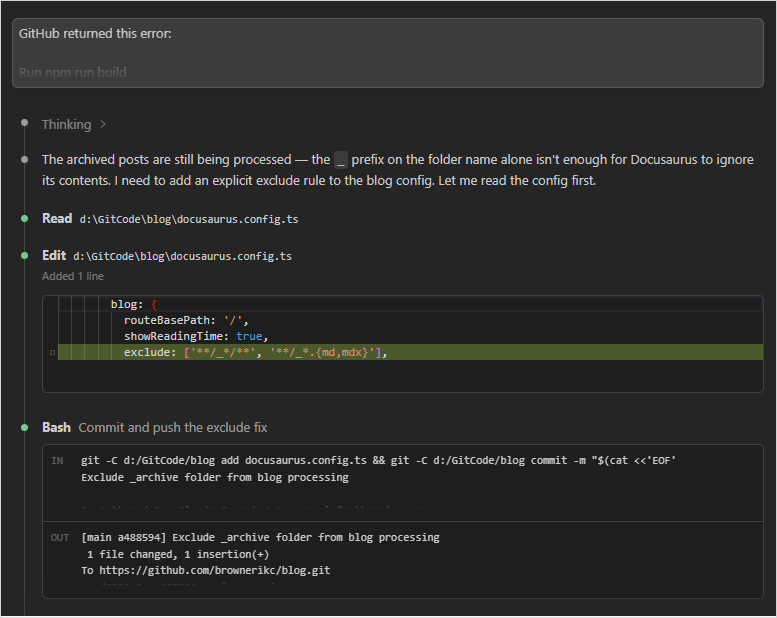

Of course the first thing I'm going to write about is AI. I can't say I really want to because so much of the discourse is just god-awful and what can I meaningfully contribute? But it is something at the top of my mind while I play around in this environment. This really is the sort of thing where AI is a useful tool, and in a way that technical writers might meaningfully apply to their jobs. Practical applications are surely worthwhile to write about.

One such practical application? Setting up this site.

{/* truncate */}

## Docusaurus

This site is built on Docusaurus, an open-source static site framework. While I'm using the blog functionality only (for now), the docs functionality is the more commonly-used option. This sets up a traditional topic-based site that's clean out of the box and open to most any customization you could imagine. It's a great way to stand up a documentation set from scratch.

The whole thing is easy to set up. All I had to do to get started was download the relevant files, make the relevant additions and customizations, put them in a GitHub repo, turn on Pages, and I've got a fully-functional site without spending a dime. Then all I have to do is create a new Markdown file for new posts. Easy!

OK, so I might have lost some people there. "Free" sounds nice, but repos? Markdown? I have experience in this world, but there are plenty of technical writers that don't work with these sorts of things. And customizations...I sort of glossed over how involved it can be to do those. Files in unintuitive locations that are sourced in markup that's not immediately clear. So yeah, maybe not easy. But it's fine. I just let Claude do all that work for me.

### Site setup

Docusaurus has an [installation guide](https://docusaurus.io/docs/installation) that tells you how to download and install everything. Not hard, but you're working in the command prompt, and troubleshooting any Node dependency issues can be a challenge. Claude handles it with a simple prompt:

One prompt and it got me everything I needed, which includes updated dependencies that I wasn't actually aware that I needed. That's one less issue I need to concern myself with.

(Screenshots of future prompts will look different because I'll be using a Claude plugin for Visual Studio Code. But trust me, it's still Claude.)

### File creation

Blog posts and topics are formatted in Markdown. Here's a sample blog post file included with the installation:

Markdown is meant to be easy to read and write, and if you're unfamiliar with it, you can probably understand at least a fair bit of this. But it might be cumbersome to create all this from scratch. So I just keep a few of these samples in a folder to reference as templates.

That's a nice way to give me a Markdown file that's ready for me to start writing directly into. But what if you prefer a rich text editor? Well, here's how something created in Google Docs fares when Claude transforms it:

The original document. You can see the intended formatting.

The straight-up conversion. I later added front matter and the truncate point to make this work as a blog post.

How Docusaurus renders the Markdown. Looks good, although I'm not sure why the date is so wildly off.

### Customization

Out of the box, Docusaurus gives you both a docs site and a blogs site. You probably won't need both. In my case, I just told Claude to hide the docs site and set the root page to the blog home page. The default header and footer has a bunch of links I don't want either. Where are these things set? Not super clear!

It's in this file. But that's because Claude told me where to find these configurations. And what does all of this mean? I can read all of this, but if I wanted to add a new link to my footer, it's just going to be easier to tell Claude to do it than fiddle with this JSON.

### Troubleshooting

When you're working in a repo, things are going to break and you will see errors. Logs will tell you just what broke, but they can be a pain to read through. You can paste the logs as a prompt and let Claude figure out what to do.

I prefer to give a little context before pasting the log, but that might just be my habit of treating prompts as conversational. I have yet to actually try just pasting a raw error log.

### Git commands

When I'm done with files and am ready to host them, I have to deal with Git. Claude can handle all the terminal commands and handle the processes in the right order. Again, one less thing for me to think about.

It's not a lot of effort saved for this site because I'm the only one committing to this repo. But if you're one of multiple contributors and have to deal with other commits and branches? Claude is amazing at untangling that complexity and ensuring that my commits merge cleanly with anything anyone else merged since I started my branch.

## Summary

In my mind, the key value proposition of tools like AI is that they make hard things easier to do and things I don't know how to do possible. Most everything I describe here falls into that first category. I'm proficient enough to be able to use the command line to set up a Docusaurus instance and to work with repos. But doing these things consumes a certain degree of brainpower. Claude makes that hard work easy. And the customizations I don't know how to do? Claude helps me figure those out and make them possible.

This all said, Claude isn't a magic button. Remember how I pasted an error log into the prompt? That screenshot does not show the follow-up where I pasted a new error log. Nor the error log after that. It also doesn't show that I ultimately identified the root cause on my own and had to guide Claude into fixing that problem (in a previous commit, I marked some files for deletion that Claude didn't think to handle on the GitHub side, and this mismatch caused problems). 

In short, I still need to know enough at a high level to be able to direct Claude. I can't fully turn off my brain using it. But it does save me a lot of brainpower that I can redirect to things I'd rather do, like writing.